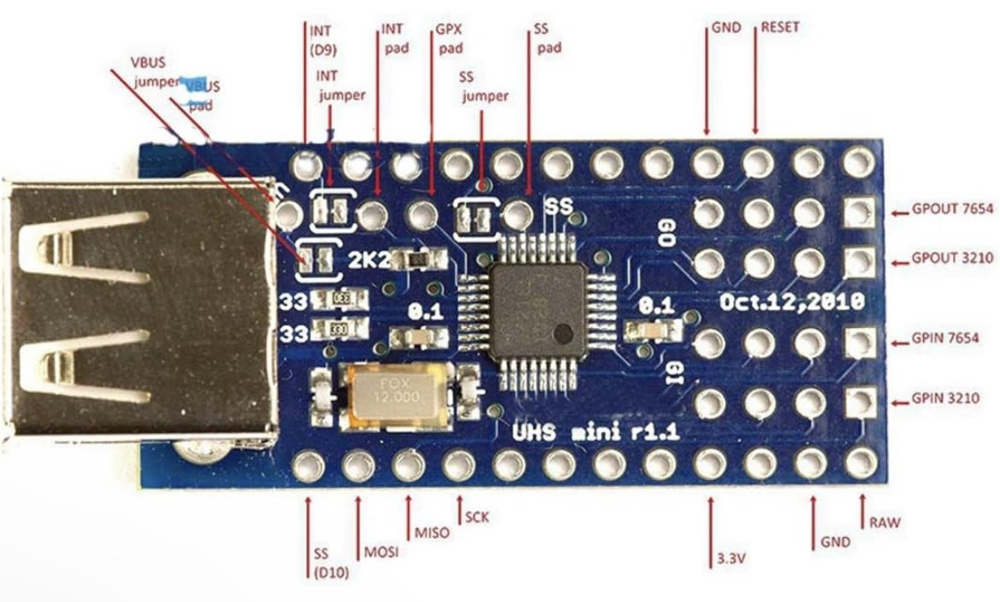

# MAX3421E <> F0

Based on earlier work (cf. [forked repo](https://github.com/jakakordez/max3421e-stm32)) porting [MAX3421e](assets/MAX3421E.pdf) driver code to the STM32 (STM32F429); here, I'm attempting to get it running using exposed `furi` funcs for use on the Flipper Zero (MCU: STM32WB55RG).

SPI `HAL` function calls have been replaced with their `furi_hal` equivalents. At present, the MAX appears to init (clears that section of the code, haven't validated with an oscillocope / logic analyzer), but hangs at the loop waiting for the USB bus to be reset after issuing the command.

Doing all testing with https://www.amazon.com/dp/B01EWW9R1E currently.

F0 pins defined [here](https://github.com/zacharyweiss/max3421e-flipper/blob/a4c936fccb98f3a719c5f3301d5bfc088b13beb6/MAX3421E.c#L161-L168) as follows:
- MISO = PA6
- MOSI = PA7
- CLK = PB3
- CS = PA4

TODO:
- Cf. [`applications/drivers/subghz/cc1101_ext/cc1101_ext.c` of the FW](https://github.com/flipperdevices/flipperzero-firmware/blob/7414e6d4dff582efb6ad716e8268cad03be65c87/applications/drivers/subghz/cc1101_ext/cc1101_ext.c) for proper use of `furi` SPI funcs
- Figure out if any timer magic needs to be done:
  - What is happening in [`main.c`'s `SystemClock_Config()`](https://github.com/zacharyweiss/max3421e-flipper/blob/75582d2e3db7e37d7162a86282d594b3b9a8cc0c/assets/.legacy_code/main.c#L111-L139)? Not currently replicating this...
- Refactor function names to be a lot more idiomatic / make clear what they do. Original code quite opaque
